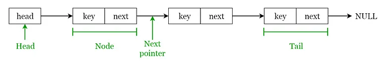

# Prep: Data Structures and Algorithms

## Why This Matters

### Arrays

* A structure of fixed-size, which can hold items of the same data type. An array with integers, can only hold integers. An array of strings, can only hold strings, etc...

### Linked Lists

* A sequential structure that consists of a sequence of items in linear order which are linked to each other. Each element within a linked list are known as nodes. Each node contains a key and a pointer to its successor node, known as next. The attribute named "head" points to the first element of the linked list. The last element of the linked list is known as the tail. Their are three types of linked lists: Singly linked, Doubly linked, and Circularly linked lists.

* To me they sound like pages in a book, but after looking at the image from the reading, it looks more like cars on a train. One way Linked Lists are used is in switching between programs using Alt + Tab.

### Stacks

* A stack is known as a LIFO which means Last In First Out, the element placed last can be accessed first. It's called a "Stack" because it resembles a stack of plates.

### Queues

* A queue is known as a FIFO which means First In First Out, the element placed first can be accessed first. It's called a "queue" because it resembles people waiting in a queue.

### Hash Tables

* A Hash Table is a data structure that stores values which have keys associated with each of them. Think Key: Value pair. From what I understand from the Reading, Direct Addressing uses the one to one mapping between the values and keys when storing in a table. If you had a Table in a Database filled with Key: Value pairs it could be a very tedious and impractical process to store more pairs inside once it gets past a certain size. We use Hash Functioning to overcome this issue. Hash Functioning put simply, calculates the index of the table to which each value goes and naming that index, the hash value.

### Trees

* A Hierarchical structure where data is organized hierarchically and are linked together. This structure is different from a linked list because in a linked list, items are linked in a linear order. Their are many different types of trees, but the main one focused on in the Reading is the Binary Search Tree.

### Heaps

* A heap is a special case of a binary tree where the parent nodes are compared to their children with their values and are arranged accordingly.

### Graphs

* A graph consists of a finite set of vertices or nodes and a set of edges connecting these vertices. The order of a graph is the number of vertices in the graph, and the size is the number of edges.

## What is 1 of the more important things you should consider when deciding which data structure is best suited to solve a particular problem?

* The overall size of our Data Pool, and how long it would take to search through it, and add or remove information to it.

## How can we ensure that we'll avoid an infinite recursive call stack?

* By always providing a break point (aka Base Case) to allow the call to end when it meets the right criteria.

## Things I want to know more about

* I think I have a very minor understanding for all of the different Data Structures, Some of the earlier ones in the Reading I think I understand a little more clearly. But Hash Tables in particular still feel a bit confusing to me, so I'm curious to understand them better.