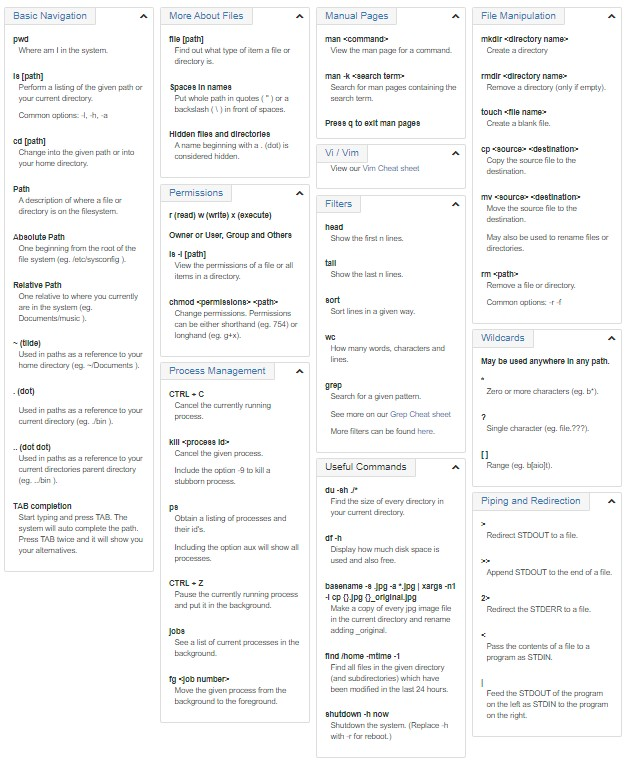

# The Command Line

* The Command line provides us with a prompt and awaits any commands that we input. Once we have entered a command it executes that command and returns a text based feedback. To open the Terminal we can typically find it in our Applications. Although if we are on a windows machine and want to remotely log into another machine then we will need what is known as an SSH client, according to the article. The portion of the Terminal we see when we open it is called the Shell, currently I'm running BASH which is one of many different types of Shells.

## Basic Navigation

* To find the name of the specific directory (fancy word for folder) you are in, you can use the command 'pwd' which stands for 'Present Working Directory'. If we want to see what files are in our Present Directory, then we can enter the command 'ls' which will return a 'list' of all of the files within our present working directory. We can also change which Directory we are currently in with the command 'cd' which changes our current directory. We can specify which file to change to by adding '..' to the end of our cd. '..' represents the parent folder of our current directory, we have a few different ways to change or denote our current filepath. '.' represents our current folder, and '~' represents our root folder.

## More About Files

* The article mentions that one of the first Ideas we need to wrap our heads around is that according to Linux, everything is a file. The next is that unlike Windows where the extension following the file name is extremely important, Linux does not use extensions. Linux treats file extensions as if they were just part of the file name, this is how we're able to open 'image.jpg'. Linux is also Case Sensitive, which is how we're able to have 'FILE1.txt' 'File1.txt' 'file1.txt' and have each of these recognized as different files. In order to find a file that is hidden, we can use the -a option after our ls command for example: 'ls -a' will return a list with all of our files in the current directory, including any hidden files.

## Manual Pages

* Manual pages are a set of pages that explain every command available on your system including what they do, how to initiate them, and what arguments they will accept. Essentially this is our 'explain this' command. This feels like it could be a very potentially useful command to use. We can also perform a keyword search across all of our manual pages with the command 'man -k' followed by any keywords we're using to try and locate a specific manual page.

## File Manipulation

* We can make a directory of files with the command 'mkdir'. From there if we need to move it we can do so with the command 'mv', copy it with 'cp', remove it (if its empty) with 'rm', and create files with the 'touch' command. We have a lot of tools at our disposal to navigate the terminal without a Graphical User Interface, it can be intimidating to try and remember all of these commands when someone first starts trying to use the Terminal, but thankfully the article provides us with a Cheat Sheet that we can use until we've built up some more fluency with the Command Line.

## Cheat Sheet

